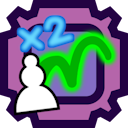
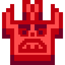
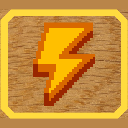
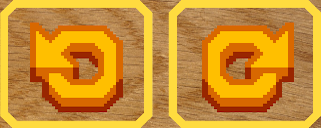

+++
date = "2018-04-17T00:00:00+02:00"
draft = false
title = "Chessito"
toc = false
tags = ["game", "chess", "boardgame", "rust"]
categories = ["game", "rust"]
description = "A Chess inspired game with custom game rule"
image = "thumbnail.png"
+++

<iframe frameborder="0" src="https://itch.io/embed/2780275?bg_color=0a7318&amp;link_color=f8fa6b&amp;border_color=054078" width="552" height="167"><a href="https://mewily.itch.io/chessito">ChessIto by Mewily</a></iframe>

Loading this game can take some time.

<iframe frameborder="0" src="https://itch.io/embed-upload/10700404?color=210033" allowfullscreen="" width="960" height="560"><a href="https://mewily.itch.io/chessito">Play ChessIto on itch.io</a></iframe>

Can be played on Pc and Mobile



# Relics

Relics allow you to change some aspect of the game.

-  Pin / Anticipation 📌

Remove move that lead  to an imminent defeat. Also display yellow and red pin into concerned piece.

-  Play twice x2

Allow you to do 2 move during your turn. You can also move the same piece twice.

-  Explosion ! 💥

When a piece is captured, neighboring pieces are also captured. Regular pawn are immune to explosion.

-  ~~Kirby~~  Absorbed mode : ♞

When you capture a pawn, your piece also absorbs the pawn's move set!

*The relic system is inspired by Slay the Spire*

# Player and Cpu

Click on an icon to change the player kind :

-  Human player.
-  Cpu on easy.
-  Cpu on normal.
-  Cpu on hard.

# Ui Buttons

-  Lightning ⚡ : Allow you to see all player move set !

-  Undo Redo ⌛ : Go back in time to cancel a bad move.

# Rule

*ChessIto* has a few minor differences from traditional chess :

- No stalemate or draw. If you can't move, you lose.
- Promotion is forced to Queen
- No repetition rule

# Credits

The full list of credits is available in-game.

- [Modern chess sprite by Cburnett](https://commons.wikimedia.org/wiki/Template:SVG_chess_pieces)
- [Wood Texture by William Warby](https://www.flickr.com/photos/wwarby/5106733699/in/photostream/)
- [Music Stream Loops 2023/11/29 by Tallbeard Studios](https://tallbeard.itch.io/music-loop-bundle)
- [Sound Effects are from Freesound](https://freesound.org/)
- [Pixel Art Ui Icon by Thomas / Mewily](https://mewily.itch.io/hud-icon-32px)

# Code Source

This game was made in [Rust](https://www.rust-lang.org/) using [Macroquad](https://macroquad.rs/)

The code source of the game is [available on github here](https://github.com/Thomas-Mewily/chessito).
