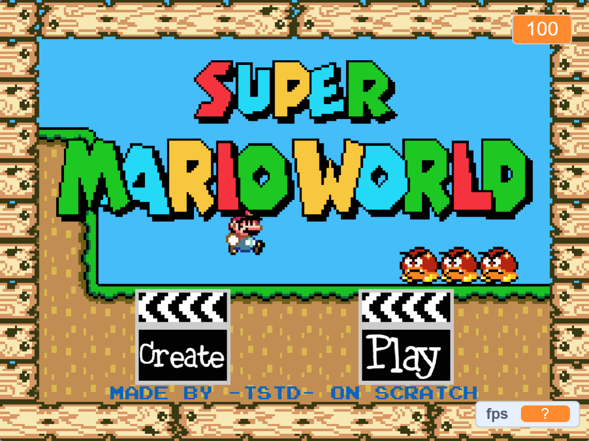
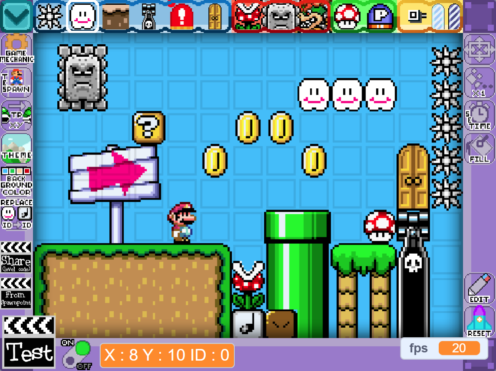
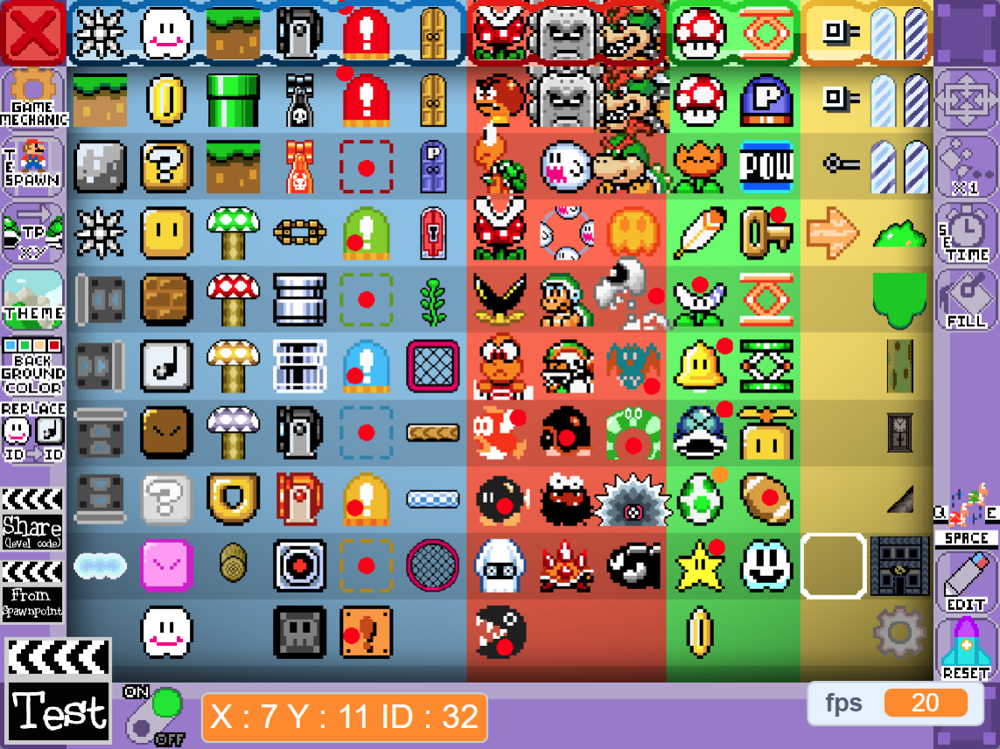

+++
date = "2018-04-17T00:00:00+02:00"
draft = false
title = "Mario Maker V6 on Scratch"
toc = false
tags = ["scratch", "mario", "maker", "platformer"]
categories = ["scratch", "game"]
description = "A Mario Maker like game where you can create and share your level"
image = "thumbnail.png"
+++

## About

This is a mario maker / platformer game I made when I was 15 using Scratch.

## Controls 

- **Arrows Keys** or **WASD** : Move, Jump, Crouch
- **Space** : Hold an Item, Open Door, Power Up



## Resource

- You can share and import level code from [this Scratch forum](https://scratch.mit.edu/discuss/topic/298548/).

- The ID Tables/List to import custom blocs and entities is [available here](https://ego-lay-atman-bay.github.io/super-mario-maker-v6/tables/).

- A more complete version of the game made by [ego-lay_atman-bay](https://scratch.mit.edu/users/ego-lay_atman-bay/) is [can be played here](https://scratch.mit.edu/projects/424176481/).

## Credits

- Nintendo for the most of sprites, sounds, musics, idea... (this game is a fan game based on Super Mario Maker)

- [AwesomeZack](https://mfgg.net/index.php?act=user&param=09&uid=11701) for some custom sprite ( like new mario power up, *unused content* )

- [SBissay](https://scratch.mit.edu/users/SBissay/) to help me with the rotating hitbox ( with the flame )

## Notes

- The game is a beta/not finished (and will probably never will), check the Scratch description for more information.

- A more complete version of the game made by [ego-lay_atman-bay](https://scratch.mit.edu/users/ego-lay_atman-bay/) is [can be played here](https://scratch.mit.edu/projects/424176481/).

<!--

-->